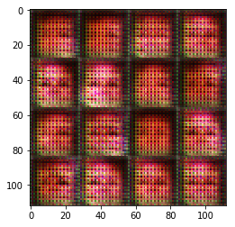
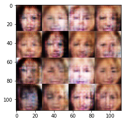
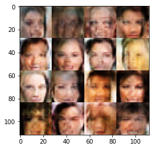
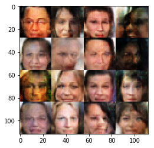

===================
Face_generation_GAN
===================

*Use a generative adversarial networks(GAN) to generate realistic images of faces*

Getting started
---------------

Run the `notebook <https://github.com/AdmcCarthy/Face_generation_GAN/blob/master/dlnd_face_generation.ipynb>`_
 to try out the GAN on the MNIST and celibrity face dataset.

